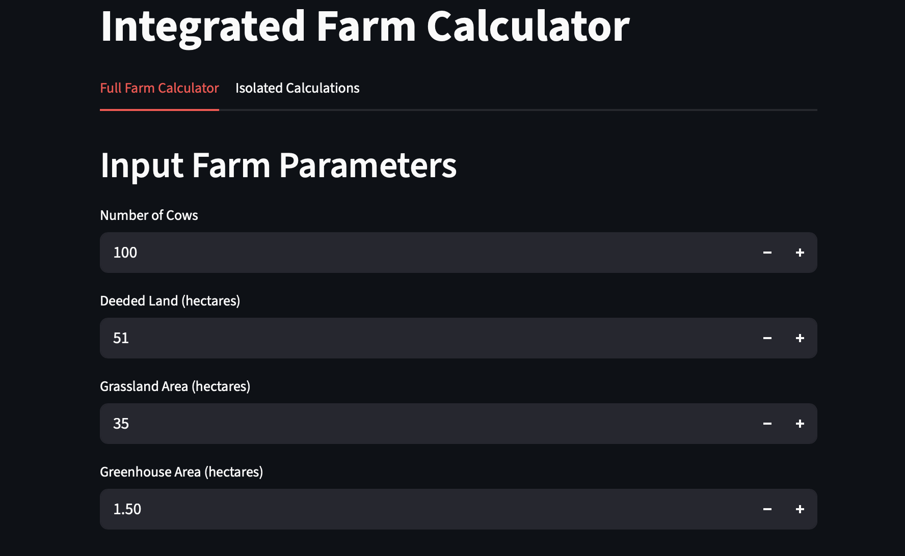

# Integrated Farm Calculator

## Overview and Insight
The **Integrated Farm Calculator** is a Streamlit-based web application designed to model and optimize an integrated sustainable farm system. It combines dairy farming (with customizable allocation to milk, cheese, or cream), soilless (hydroponic) greenhouse production for various crops, and biogas energy generation from cow manure. By inputting parameters like cow numbers, land areas, and constants (e.g., yields, prices), users can simulate farm operations, calculate financial metrics (investment, costs, revenues, profit, payback), and view 5-year projections. The app emphasizes synergies: manure fuels biogas for electricity (covering on-farm needs, selling surplus, or purchasing shortfalls), while diversified products reduce risks.

This tool provides insights into self-sufficiency—balancing feed production, energy independence, and income diversification—for mid-to-small scale farms (e.g., 100 cows, 1.5 ha greenhouse). Defaults use mid-range values for realism (e.g., 25 L milk/cow/day, 300 tons/ha tomato yield), but all are editable. It's ideal for farmers, planners, or educators to explore scenarios, highlighting trade-offs like high greenhouse energy demands vs. revenue potential. Limitations include simplified assumptions (e.g., no detailed seasonality or taxes); use for initial planning, not final decisions.

## Features
- **Full Farm Simulator**: Comprehensive model with land allocation, feed checks, dairy/greenhouse revenues, biogas energy, financial tables, pie charts (revenue/cost breakdowns), line plots (projections), and insights (risks/mitigations).
- **Isolated Calculations**: Standalone tools for biogas energy from cows (daily/monthly/yearly kWh) or greenhouse energy consumption.
- **Customizable Inputs**: Dairy allocation sliders; crop selection (Tomato, Lettuce, Strawberry, Cucumber); editable constants with range guidance (low/mid/high) in labels.
- **Error Handling**: Validates dairy % sum; warns on land insufficiency.
- **Visuals**: Interactive Plotly charts; formatted tables in USD/TRY.

## Summary of Factors and Parameters
The app integrates factors like land use, feed, production, energy, and finances. Defaults are mid-values; labels show ranges for guidance (e.g., adjust for optimistic/pessimistic scenarios).

### Key Factors
- **Land & Feed**: Allocates deeded land to pasture, crops, greenhouse, buildings; checks self-sufficiency, costs purchases if short.
- **Dairy**: Milk production allocatable to raw milk, cheese, cream; revenues from yields/prices.
- **Greenhouse**: Crop-specific yields/prices; high energy needs but year-round output.
- **Energy**: Manure to biogas/electricity; nets surplus (revenue) or shortfall (cost).
- **Financials**: Scaled investments/ops costs; revenues from products/energy; profit, payback, projections (2% revenue/3% cost growth).
- **Insights**: Feed/energy status; risks (prices, diseases, seasonality) with mitigations.

### Parameters (Defaults; Ranges in Labels)
- **Currency**: USD/TRY rate (40; 30-50)
- **Dairy**: Milk yield (25 L/cow/day; 20-30), Milk price (0.4 USD/L; 0.3-0.5), Cheese price (5 USD/kg; 4-6), Cream price (3 USD/kg; 2-4)
- **Greenhouse (Crop-Varies)**: Yield (e.g., Tomato: 300 tons/ha/year; 100-600), Price (e.g., Tomato: 0.25 USD/kg; 0.1-0.4)
- **Biogas/Energy**: Manure/cow (60 kg/day; 40-80), VS fraction (0.096; 0.08-0.12), Biogas yield (0.3 m³/kg VS; 0.2-0.45), Energy/m³ (6 kWh; 5-7), Efficiency (0.35; 0.3-0.4), Sell price (0.1 USD/kWh; 0.08-0.12), Purchase price (0.15 USD/kWh; 0.12-0.18)
- **Feed**: DM/cow/year (6570 kg; 6000-7000), Grassland yield (5250 kg DM/ha/year; 4000-6500), Crop yield (15000 kg DM/ha/year; 12000-18000), Purchased cost (0.1 USD/kg DM; 0.08-0.12)
- **Costs**: Greenhouse construction (500000 USD/ha; 300000-700000), Farm electricity (500 kWh/cow/year; 400-600), Greenhouse electricity (1000000 kWh/ha/year; 500000-1500000)

## Installation
To run locally:

1. Install Python 3.8+ and dependencies:
'pip install streamlit pandas plotly numpy'

3. Save code as `app.py` and run:
'streamlit run app.py'

## Usage
- **Full Tab**: Input parameters, allocate dairy, select crop, tweak constants. View tables/charts/summary.
- **Isolated Tab**: Compute energy production (cows) or consumption (greenhouse) separately.
- Browser-based; updates live.

## Deployment
Deploy to Streamlit Community Cloud:
1. Push to GitHub (include `app.py`, `requirements.txt`).
2. Sign in at streamlit.io/cloud, link repo, deploy for public URL.

## Project Structure
- `app.py`: Main code.
- `requirements.txt`: Dependencies.
- `README.md`: This file.
- `screenshot.png`: App screenshot (optional).

## Contributing
Fork, branch, PR. Follow PEP 8.

## License
MIT License.

